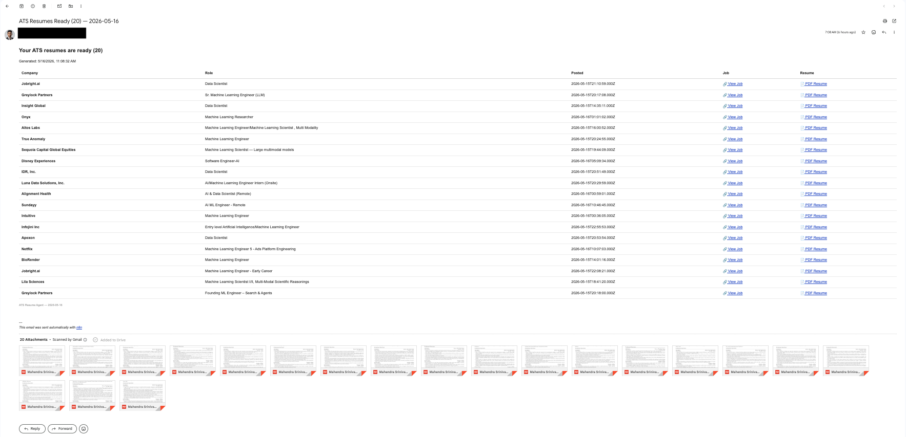

# AI Job Search and Resume Automation

A sanitized portfolio version of a personal AI workflow automation project built with n8n. The workflow automates job discovery, duplicate tracking, LLM-assisted resume tailoring, ATS-friendly PDF generation, Google Drive storage, and daily email summaries.

This project is designed to demonstrate workflow automation, product thinking, API integrations, LLM orchestration, structured document generation, database tracking, and end-to-end debugging.

> This is a personal automation project, not a commercial job application product. It does not auto-apply to jobs. The workflow prepares resume drafts and job/resume links, while the final review and application decision stay human-in-the-loop.

## Problem It Solves

Manually applying to jobs is repetitive and time-consuming. Each role usually requires reading the job description, identifying relevant keywords, tailoring resume content, exporting a clean PDF, tracking whether the job was already processed, and organizing application materials.

This workflow reduces that repetitive work by preparing job-specific resume drafts and sending a daily summary of application-ready materials.

## Key Features

- Automated job discovery from recent LinkedIn job postings
- Configurable job search query and result count
- Duplicate job detection using Supabase
- LLM-assisted resume tailoring based on each job description
- Structured prompt rules to reduce hallucinations
- ATS-friendly LaTeX resume generation
- Google Drive upload and sharing for generated PDFs
- Gmail summary with job links and resume links
- Scheduled daily execution through n8n
- Error handling for API limits, duplicate keys, formatting issues, and multi-item workflow behavior
- Human-in-the-loop final review and application decision

## Workflow Architecture

Daily Schedule Trigger
    ↓
Workflow Configuration
    ↓
Build LinkedIn Search URL
    ↓
Apify LinkedIn Jobs Scraper
    ↓
Poll Job Scraper Status
    ↓
Fetch Job Results
    ↓
Parse and Normalize Job Data
    ↓
Limit Jobs
    ↓
Filter Duplicates with Supabase
    ↓
Retrieve Base Resume from Google Docs
    ↓
Prepare Job + Resume Prompt
    ↓
LLM Resume Optimizer
    ↓
Merge Job Metadata
    ↓
Build LaTeX Resume
    ↓
Compile PDF
    ↓
Prepare PDF Metadata
    ↓
Upload and Share PDF in Google Drive
    ↓
Store Processed Job Record
    ↓
Send Gmail Summary

## Tech Stack

| Area | Tools |
|---|---|
| Workflow orchestration | n8n |
| Job data source | Apify LinkedIn Jobs Scraper |
| LLM | Google Gemini API |
| Database / tracking | Supabase PostgreSQL |
| Resume source | Google Docs |
| File storage | Google Drive |
| Notification | Gmail |
| Resume rendering | JavaScript, LaTeX, PDF compilation API |
| Hosting | VPS, Docker, Docker Compose |

## How It Works

1. A scheduled n8n trigger starts the workflow daily.
2. The workflow builds a LinkedIn search URL from a configurable search query.
3. Apify fetches recent job postings.
4. A parser cleans job descriptions, normalizes job URLs, and removes weak or duplicate entries within the same batch.
5. Supabase checks whether a job URL was already processed.
6. The workflow retrieves the base resume from Google Docs.
7. An LLM receives the resume and target job description and returns a tailored resume in a strict section format.
8. A JavaScript node converts the structured resume text into LaTeX.
9. The LaTeX is compiled into a PDF.
10. The PDF is uploaded to Google Drive and shared.
11. The job is stored in Supabase to avoid future duplicate processing.
12. A Gmail summary is sent with each company, role, job link, and resume link.

## Example Output

The workflow sends a daily email summary with generated resume links and related job links.


```text
## Repository Structure

ai-job-search-resume-automation/
  README.md
  docs/
    architecture.md
    workflow-overview.md
    setup-guide.md
    prompts.md
    decisions-and-tradeoffs.md
    troubleshooting.md
  workflows/
    n8n-workflow-sanitized.json
  scripts/
    README.md
    parse-apify-results.js
    filter-duplicates.js
    build-latex-resume.js
    prepare-pdf-metadata.js
    email-summary.js
  samples/
    sample-job-input.json
    sample-resume-output.md
    sample-email-summary.md
    sample-supabase-schema.sql
  assets/
    workflow-canvas.png
    scheduled-workflow.png
    email-summary-20-jobs.png
    supabase-jobs-table.png
    drive-output-folder.png
    generated-resume-preview.png
  .env.example
  .gitignore
```

## Product Decisions

### Why n8n?

n8n made it easy to connect multiple systems quickly while still allowing custom JavaScript where the workflow needed more control. This project required orchestration across scraping, database checks, LLM generation, document rendering, Drive upload, and Gmail notification.

### Why Supabase?

Supabase provides a simple PostgreSQL-backed way to persist processed jobs. Using job_url as the primary key prevents the same job from being processed repeatedly across daily runs.

### Why LaTeX?

The LLM generates structured resume text, but LaTeX handles the final formatting. This separation gives more control over spacing, headers, bullets, PDF rendering, and ATS-friendly output.

### Why human-in-the-loop?

The workflow prepares tailored resume drafts and organizes application materials. It does not submit applications automatically. A human still reviews each resume and decides whether to apply.

## Challenges and Fixes

- Duplicate job records were handled by normalizing LinkedIn URLs and tracking processed jobs in Supabase.
- Supabase duplicate key errors were handled by checking existing jobs before insert and allowing the workflow to continue on duplicate insert errors.
- LLM quota limits were handled by reducing batch size, using retries, testing lighter models, and documenting paid-tier considerations.
- n8n fetch is not defined was fixed by using this.helpers.httpRequest inside n8n Code nodes.
- n8n multiple item matching errors were fixed by avoiding unsafe .item references when processing multiple jobs.
- Broken PDF hyphens and percentages were fixed with prompt formatting rules and text normalization before LaTeX rendering.
- File naming issues were fixed by simplifying output names and using safer metadata fallback logic.

## Setup

See docs/setup-guide.md for detailed setup instructions.

At a high level, you need:

1. n8n running locally or on a VPS
2. Apify account and API token
3. Supabase project and jobs table
4. Google Docs resume source
5. Google Drive and Gmail credentials
6. Gemini API key or another compatible LLM provider
7. The sanitized n8n workflow imported into your n8n instance

## Security and Privacy

This repository is sanitized for public portfolio use. It does not include real API keys, private credentials, personal resume content, Google Drive links, Supabase URLs, or private job-board credentials.

Use .env.example as a template and keep real credentials in a private .env file or n8n credentials manager.

## Future Improvements

- Add job relevance scoring before resume generation
- Add a dashboard for processed, reviewed, and applied jobs
- Add manual approval steps before final PDF generation
- Add support for multiple base resume versions
- Add stronger observability for failed workflow runs
- Add automated tests for parsing and LaTeX generation scripts
- Add support for multiple LLM providers

## Disclaimer

This is a sanitized portfolio project based on a personal automation workflow. It is intended to demonstrate technical implementation, workflow design, and product thinking. It should be adapted carefully before use with real job boards, credentials, or personal data.
